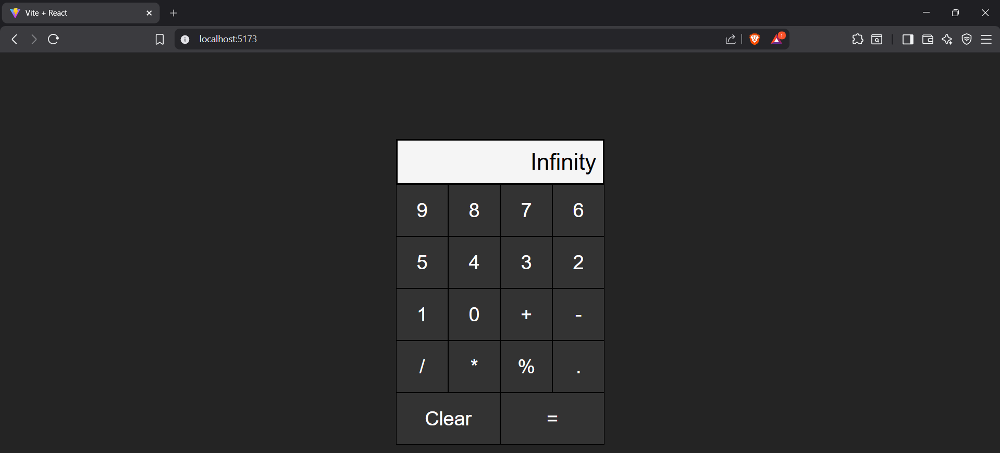

# React Calculator
A simple, interactive calculator built with React and Vite. This project demonstrates basic arithmetic operations, including addition, subtraction, multiplication, and division, with a clean and responsive user interface.
## Screenshots

## Features
- Basic arithmetic operations: +, -, *, /
- Clear and reset functionality
- Responsive design for desktop and mobile
- Built with React for component-based architecture
- Fast development with Vite
## Technologies Used
- React
- CSS
- Vite

## Project Structure
app/
├── public/
│   └── vite.svg
├── src/
│   ├── assets/
│   │   └── react.svg
│   ├── Components
│   ├── App.css
│   ├── App.jsx
│   ├── index.css
│   └── main.jsx
├── .gitignore
├── eslint.config.js
├── index.html
├── package.json
├── package-lock.json
├── README.md
└── vite.config.js

## Author
Hemanth
